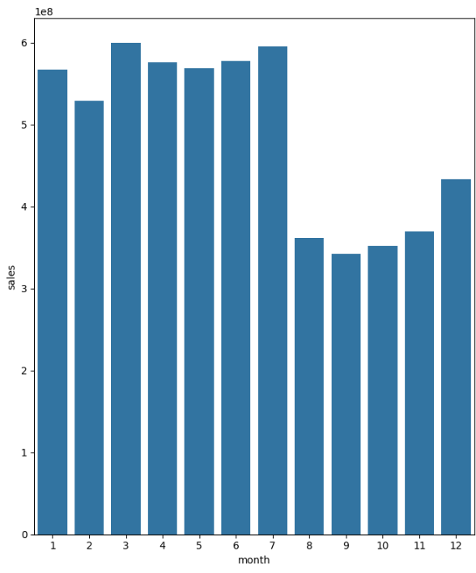
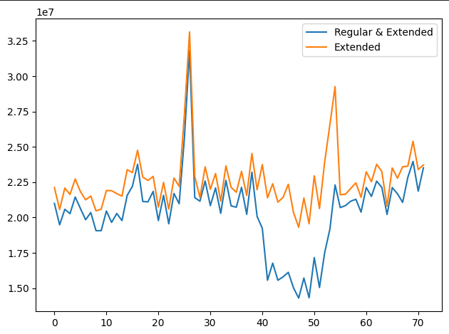
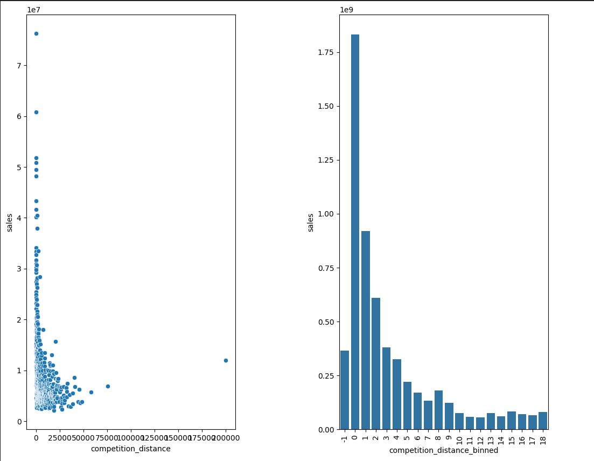
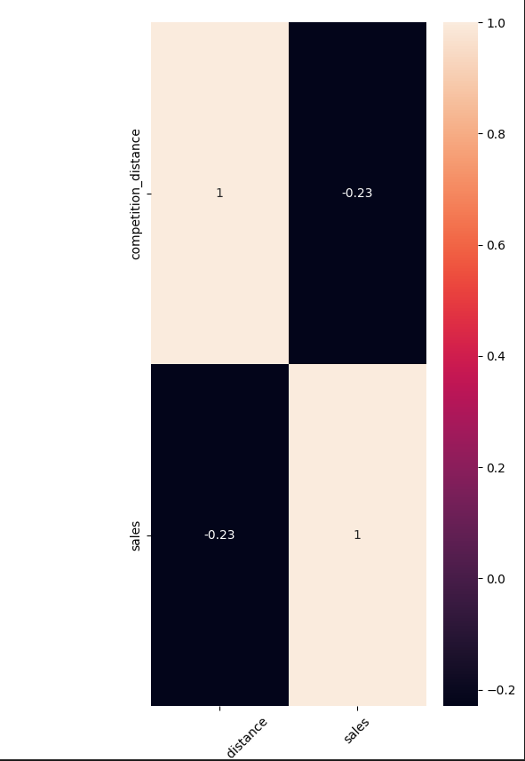

# Projeto de Previsão de Vendas na Rossmann

## **1. Problema de Negócio**

A Rossmann, é uma rede de mais de 3.000 farmácias em 7 países europeus, e no contexto atual precisa prever as vendas diárias para suas 1.115 lojas na Alemanha, a empresa possui variáveis como promoções, concorrência, feriados escolares e estaduais, sazonalidade e localidade que podem de alguma forma influenciar as vendas, a falta de previsões precisas afeta a capacidade dos gerentes de loja de criar escalas de trabalho eficazes, impactando a produtividade e motivação da equipe. Este projeto visa criar um modelo de previsão robusto para ajudar os gerentes de loja a focarem no mais importante: seus clientes e equipes.

Os dados podem ser acessados no Kaggle no link a seguir:
https://www.kaggle.com/competitions/rossmann-store-sales

## **2. Premissas Assumidas para a Análise**

- As informações sobre promoções, concorrência, feriados e sazonalidade são cruciais para a previsão de vendas.
- A precisão das previsões de vendas pode melhorar a eficiência na programação da equipe.

## **3. Estratégia da Solução**

Para abordar o problema, foi optado por uma solução baseada em aprendizado de máquina, utilizando o algoritmo de regressão XGBoost. A estratégia incluiu as seguintes etapas:

- Análise exploratória de dados para compreender a distribuição e correlação entre as variáveis.
- Pré-processamento de dados para tratar valores ausentes, outliers e normalização.
- Engenharia de recursos para extrair informações relevantes.
- Treinamento de modelos e avaliações de métricas.
- Definição, avaliação e seleção do modelo XGBoost.
- XGBoost utilizando dados históricos de vendas.
- Avaliação do modelo e ajustes de hiperparâmetros.
- Criação de uma API no Telegram para fornecer previsões de vendas para lojas específicas.

## **4. Top 3 Insights de Dados**

1. **Sazonalidade:** Foi possível identificar padrões sazonais significativos nas vendas, destacando a importância de levar em consideração os fatores temporais, foi possível identificar que as lojas tendem a vender menos  no segundo semestre do ano conforme mostra o gráfico:
    
    
    

2. **Promoções e Vendas:** A presença de promoções influencia diretamente as vendas, mostrando a necessidade de uma estratégia de promoção eficaz, já que os dados mostram que lojas com promoções consecutivas não vendem mais, os gráficos mostram as vendas ao longo do tempo, distinguindo promoções regulares e estendidas, a presença de ambas as promoções consecutivas não resulta em vendas significativamente maiores

3. **Localidade Importante:** A localização das lojas desempenha um papel crucial nas vendas, sugerindo que a estratégia deve ser adaptada às características específicas de cada região, sendo possível identificar que lojas estabelecidas em regiões com competidores mais próximos tendem a vender mais, o gráfico de dispersão e o gráfico de barras categorizado pela distancia dos competidores, mostram uma relação positiva entre proximidade e vendas

O mapa de calor de correlação também indica uma correlação positiva entre essa distancia dos competidores e as vendas

## **5. O Produto Final do Projeto**

O resultado final é um modelo de previsão baseado em XGBoost, implementado em uma API no Telegram. Os usuários podem fornecer o número da loja desejada, e o modelo retorna previsões precisas das vendas para as próximas 6 semanas,  isso permite que os gerentes de loja otimizem suas escalas de trabalho e melhorem a eficiência operacional.

### **5.1 Implementação da API no Telegram**

A API no telegram encontra-se disponivel no repositório: Rossamn-bot ( https://github.com/Eduupaiva/rossman-bot ), para acessa-lá, basta chamar o bot pelo nome 'RossmanBot' no telegram e colocar o numero da loja desejada para fazer a previsão, ex: para obter a previsão da loja 23 '/23' que o bot retorna a rpevisão.

## **6. Conclusão**

O projeto alcançou seu objetivo principal, fornecendo uma solução eficaz para a previsão de vendas da Rossmann. A colaboração de dados históricos,  técnicas de Machine Learning  e uma abordagem prática para a implementação resultaram em um modelo valioso para otimizar as operações das lojas.

## **7. Próximos Passos**

Os passos futuros incluem:

- Melhorar o modelo com dados em tempo real para previsões mais precisas.
- Buscar aprimorar o modelo para executar previsões mais granulares semana a semana/ dia a dia, sendo possível ajuste mais preciso nas estratégias de vendas .
